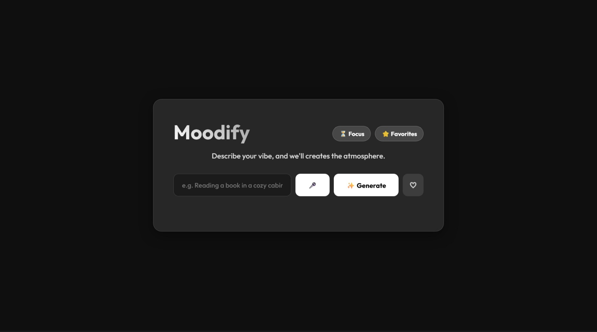

# Moodify - AI Ambience Generator

[](https://www.python.org/)
[](https://flask.palletsprojects.com/)
[](https://www.hetzner.com/)
[]()

**Moodify** is an intelligent web application that generates immersive audio-visual environments based on your text description or voice command. It combines AI-powered keyword extraction, stock video integration, and dynamic soundscapes to help you focus, relax, or get creative.

### 🚀 **Live Demo:** [https://moodify-project.duckdns.org](https://moodify-project.duckdns.org)

*(Note: Hosted on a private Ubuntu VPS. Microphone access requires HTTPS, which is fully enabled).*

---

## Features

-   **🧠 AI Mood Analysis**: Uses `sentence-transformers` (NLP) to extract context from phrases like *"Cyberpunk city in rain"* or *"Cozy library with fireplace"*.
-   **🎙️ Voice Control**: Hands-free interaction using the Web Speech API with real-time transcription.
-   **🎥 Dynamic Visuals**: Fetches high-quality 4K background videos dynamically via the **Pexels API**.
-   **🍅 Focus Tools**: Integrated **Pomodoro Timer** with customizable Focus/Break intervals.
-   **💾 Favorites System**: Save your favorite vibe configurations to LocalStorage for instant access.
-   **📱 Fully Responsive**: Glassmorphism UI that stacks perfectly on mobile devices.

---

## Tech Stack & Infrastructure

This project was built to demonstrate full-stack development and DevOps skills.

### **Frontend**
-   **HTML5 / CSS3**: Custom Glassmorphism design (No Bootstrap/Tailwind).
-   **JavaScript**: Vanilla JS for async API calls, Audio context, and Speech Recognition.

### **Backend**
-   **Python / Flask**: Lightweight REST API.
-   **Machine Learning**: `sentence-transformers` (Hugging Face) for semantic keyword extraction.
-   **APIs**: Pexels (Video), Freesound (Audio - Logic implemented).

### **DevOps & Deployment**
-   **Server**: Ubuntu 22.04 LTS VPS (Hetzner CX23).
-   **Web Server**: Nginx (Reverse Proxy).
-   **App Server**: Gunicorn (Production WSGI).
-   **Process Management**: Systemd service (Auto-restart).
-   **Security**: SSL/TLS Certificate via Let's Encrypt (Certbot).

---

## 📸 Gallery

### 🎥 **Demo Video**
[](static/assets/Microphone%20and%20vibe%20found.mp4)
*(Click the image above to play the video)*

---

### **1. Home Screen**
The minimal glassmorphism interface where you start your journey.


### **2. Vibe Found & Generation**
Result of the AI analysis: Video background loads, soundscape plays, and mood keywords appear.


### **3. Saving to Favorites**
Clicking the heart icon (❤️) instantly saves your current vibe configuration.


### **4. Favorites Menu**
Access all your saved atmospheres in one place.


### **5. Pomodoro Timer**
Stay productive with the integrated Focus Timer featuring custom duration controls.


---

## 🔧 Setup & Installation (Local)

1.  **Clone the repository**:
    ```bash
    git clone https://github.com/SomyaPatidar06/Moodify.git
    cd Moodify
    ```

2.  **Create a virtual environment**:
    ```bash
    python -m venv venv
    source venv/bin/activate  # or venv\Scripts\activate on Windows
    ```

3.  **Install dependencies**:
    ```bash
    pip install -r requirements.txt
    ```
    *(Note: Linux requires specific versions of Torch/Numpy pinned in requirements.txt)*

4.  **Environment Variables**:
    Create a `.env` file:
    ```
    PEXELS_API_KEY=your_key_here
    FREESOUND_API_KEY=your_key_here
    ```

5.  **Run the App**:
    ```bash
    python app.py
    ```
    Access at `http://127.0.0.1:5000`

---

## 📄 License

This project is open-source and available under the MIT License.
